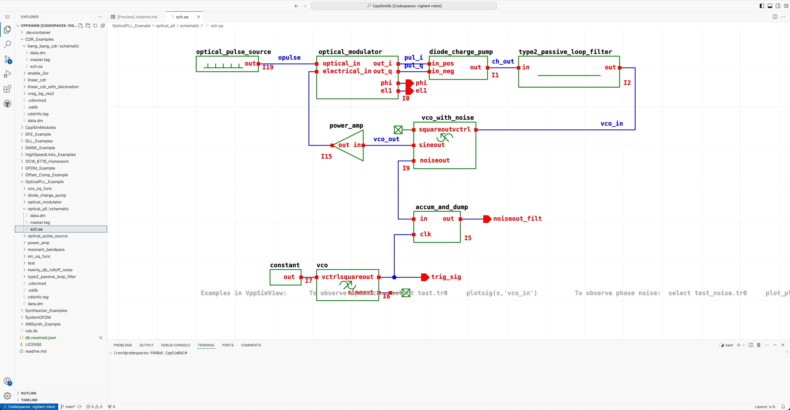

# CppSim Database

The [CppSim for Cadence](https://cppsim.com/download_hspice_tools.html) schematic and model database.  
Running in VsCode and your favorite browser courtesy [GenAlpha Schematics](https://marketplace.visualstudio.com/items?itemName=gen-alpha-xtor.schematics-vscode).

<picture style="max-width:600px;width:100%">
  <source 
    media="(prefers-color-scheme: dark)" 
    srcset="./doc/optical_pll_dark.jpg"
  >
  <source 
    media="(prefers-color-scheme: light)" 
    srcset="./doc/optical_pll_light.jpg"
  >
  
</picture>
